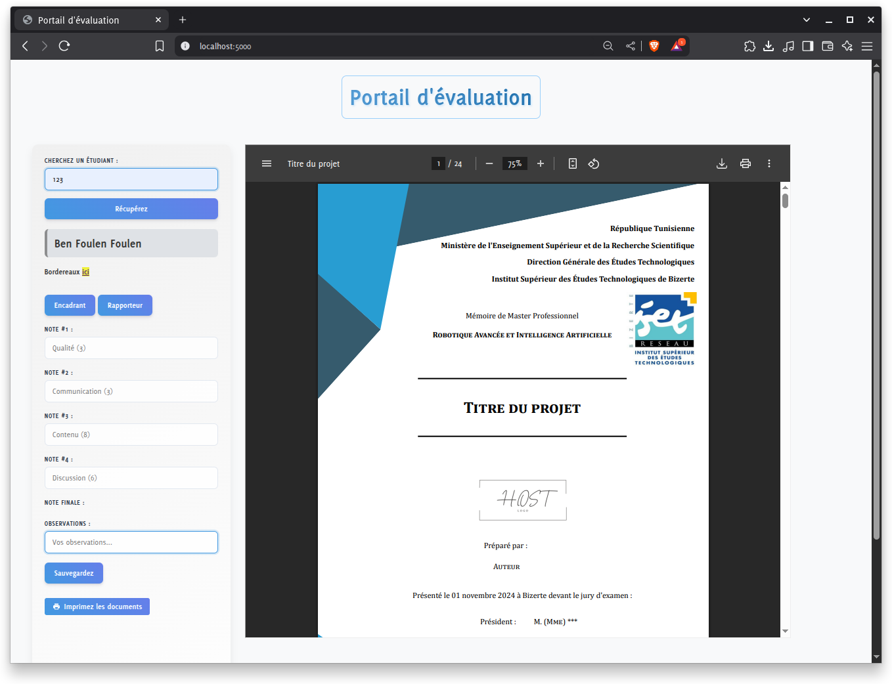

# Plateforme numérique d'évaluation des mémoires de master


Pour lancer le serveur, il suffit de tapper la commande suivante:

```bash
pm2 start
```



Le code est publié sous licence MIT. Consultez le fichier [LICENSE](LICENSE) pour plus de détails.
